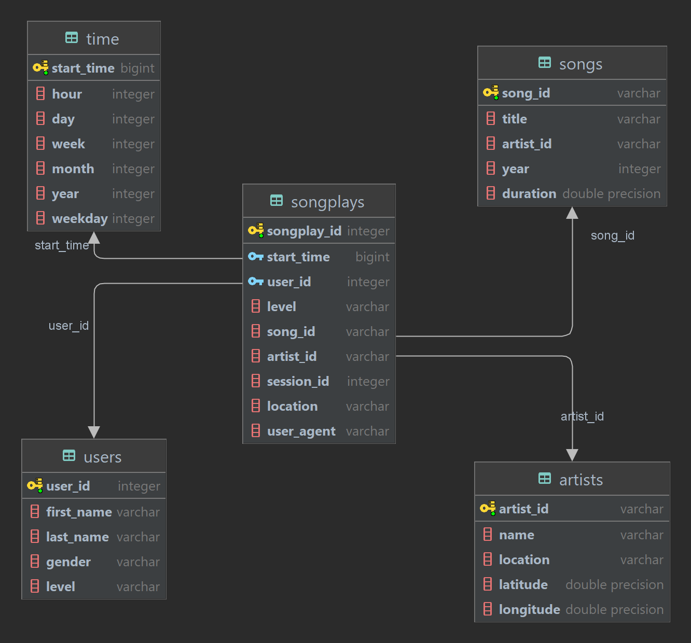

# 1. Discuss the purpose of this database in the context of the startup, Sparkify, and their analytical goals.

The purpose of this database is to get the analytical data about music and their related information to get to know more about their artists and users such as:
- Which song is played the most?
- The artist that has the song which is played the most. This metric can be used to award that artist.
- Collection of songs that are played the most for a user for each year.
- How many paid and free users?
- How many users? The ratio of male and female users?

# 2. State and justify your database schema design and ETL pipeline.

## 2.1 Schema design

### 2.1.1 Final tables

The schema design is followed by the guide in project instructions, including 1 fact table and 4 dimension tables and have the schema like below:

### 2.1.2 Staging tables

These are 4 staging tables, including 2 tables (stg_events and stg_songs) to load data from S3 and 2 tables (stg_users and stg_artists) to transform data from stg_events and stg_songs and load into users and artists **because Redshift does not support upsert feature**. The two columns (last_updated in stg_users and year in stg_artists) are used to check if the version of each records in users and artists are the latest updated.

## 2.2 ETL pipeline

### 2.2.1 ETL flow diagram

### 2.2.2 Steps

1. Read arguments from dwh.cfg to connect to database.
2. Call function to execute queries to load data from S3 to `stg_events` and `stg_songs`. Data from log_data will be loaded to `stg_events` and data from song_data will be loaded to `stg_songs`.
3. Data from users and artists can be updated by time, like users can update their level from free to paid or downgrade from paid to free, artists can change their location by time so to load these data correctly we must use upsert. Redshift in AWS does not support upsert so I create two staging tables are `stg_users` and `stg_artists` to load only the latest version for each user and artist by comparing column `ts` in `stg_events` and `last_updated` in `stg_users`, `year` in `stg_songs ` with `year` in `stg_artists`.
4. Load data from `stg_songs` into `songs`.
5. Load data from `stg_artists` into `artists`.
6. Load data from `stg_events` into `time` by transforming column `ts` (type `bigint`) to type `timestamp`.
7. Load data from `stg_users` into `users`.
8. Load data from `stg_events` to `songplays`.

# 3. [Optional] Provide example queries and results for song play analysis.

- Which song is played the most: `select song_id, count(*) total_played from songplays group by song_id order by total_played desc;`
- The artist that has the song which is played the most: `select artist_id, song_id, count(*) total_played from songplays group by song_id, artist_id order by total_played desc;`